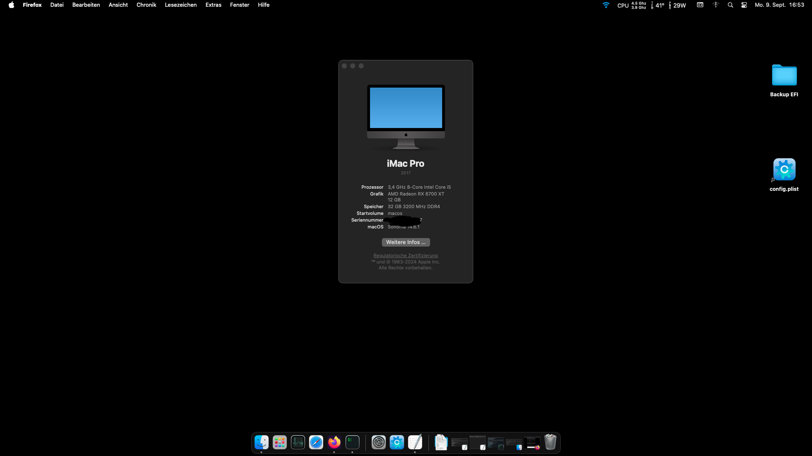

# EFI-RYZEN-B550-RX6600

:information_source: **The current version is fully macOS Monterey, Ventura and Sonoma compatible.**
OpenCore, drivers, and kexts are always up to date!

 

:warning: **DISCLAIMER:**
THIS IS NOT A GUIDE!
 
It's just my complete EFI for my hardware based on my experiments, please refer to [Dortania](https://dortania.github.io/getting-started/) before doing anything. I am not responsible for any damage. This OpenCore configuration is optimized for my specific hardware, so please use it only as a reference or if you happen to have the same or similar hardware.

## :computer: Hardware:

| **Category** | **Component**                                                                    |
| ------------ | -------------------------------------------------------------------------------- |
| **CPU**      | 3,4 GHz AMD Ryzen 7 5700x 8-Core Processor                                        |
| **GPU**      | ASROCK Challenger - AMD Radeon RX 6700 8 GB Challenger 8GB                       |
| **RAM**      | 32GB GSKILL DDR4 3200MHZ (XMP)                                                   |
| **CHIPSET**  | B550M DS3H [Gigabyte](https://www.gigabyte.com/Motherboard/B550M-DS3H-rev-1x#kf) |
| **SSD**      | 1TB Western Digital SSD                                                          |
| **Wi-Fi/BT** | Archer T3U Plus                                                                  |
| **Ethernet** | Realtek RTL8111                                                                  |
| **Audio**    | Realtek ALC897 (layout-id=12)                                                    |

## :white_check_mark: Working:

- [x] CPU power management.
- [x] Graphics acceleration.
- [x] Keyboard & Mouse
- [x] Wi-Fi.
- [x] Bluetooth.
- [x] USB ports.
- [x] HDMI video & audio output.
- [x] Ethernet. (Idk should 100% work)
- [x] Audio (Internal speakers, 3.5mm headphone jack).
- [x] Internal microphone.
- [x] VGA WebCam.
- [x] iCloud & App Store.
- [x] iMessage & FaceTime.

## :x: Not working:

~~Wi-fi, Bluetooth and AirDrop are not working since i don't have yet a native Wi-fi card and my motherboard doesn't have one.
Currently using with wired network on my ethernet port~~

## :closed_lock_with_key: SMBIOS

You will need to generate your own SMBIOS and configure, since is required to fully work with macOS. As per this [guide](https://dortania.github.io/OpenCore-Install-Guide/AMD/zen.html#platforminfo) you can use the following SMBIOS: iMacPro1,1 or MacPro7,1. Note that if your hardware is different for the one mentioned [here](#computer-hardware) you have tho choose an appropriate SMBIOS, more details in the [guide](https://dortania.github.io/OpenCore-Install-Guide/AMD/zen.html).

Use [GenSMBIOS](https://github.com/corpnewt/GenSMBIOS) to generate your own unique SMBIOS and then copy each parametter following path (recomended to follow the guide above):

- Config.plist -> PlatformInfo -> Generic

## BIOS setup:

IMPORTANT: Need to **enable** Above 4G Decoding and set Resize BAR to Auto on BIOS or will not work!
If you don't have this on your BIOS you will need to adjust the config.plist, refer to [AMD bios settings](https://dortania.github.io/OpenCore-Install-Guide/AMD/zen.html#amd-bios-settings) and [boot-args](https://dortania.github.io/OpenCore-Install-Guide/AMD/zen.html#nvram)

## Credits:
[**Gabriel Luchina**](https://luchina.com.br)

[**AMD-OSX**](https://github.com/AMD-OSX/AMD_Vanilla)

[**Acidanthera**](https://github.com/acidanthera)

[**Dortania**](https://dortania.github.io/getting-started/)

[**Apple**](http://apple.com/)
